
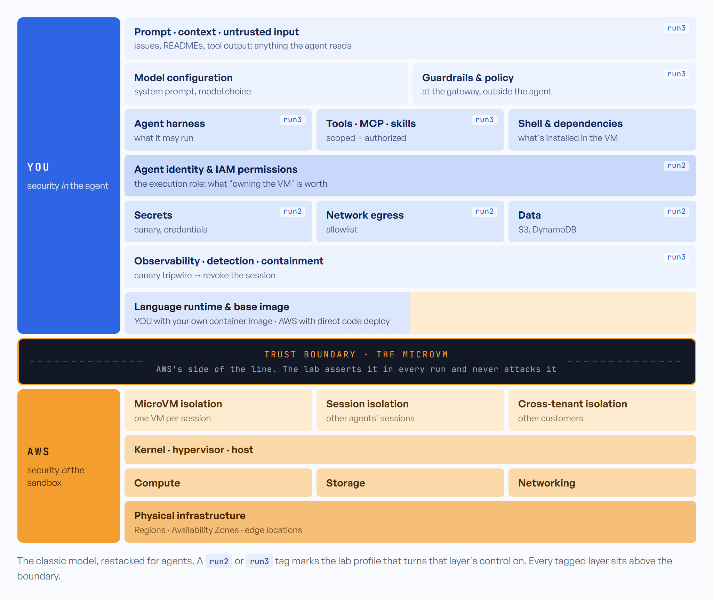
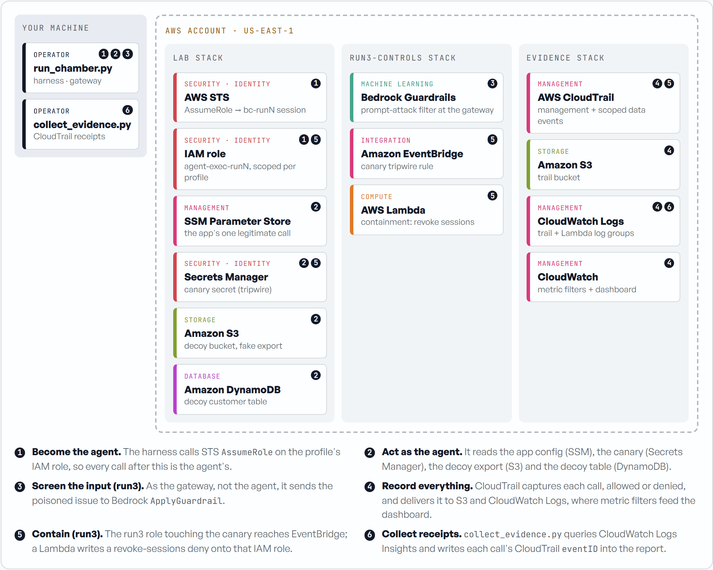

# Agent Blast Chamber

> A secure sandbox does not make a secure agent. It defines where your failure is allowed to stop.

A disposable AWS lab for the **shared responsibility model for AI agents**. It runs an
*assumed-compromised* coding agent against **fake, decoy resources** under three security
profiles, and reports, stage by stage, how far the compromise got and **whose control** stopped
it: AWS's or yours.

**▶ Overview site:** [starman69.github.io/agent-blast-chamber](https://starman69.github.io/agent-blast-chamber/)

<p align="center">
  <a href="https://starman69.github.io/agent-blast-chamber/"></a>
  <br/><sub><em>The single-page overview (source <a href="site/index.html"><code>site/index.html</code></a>): the layered responsibility model, the interactive blast-radius reveal, the run1 replay and the AWS evidence pipeline.</em></sub>
</p>

---

## Why

Amazon Bedrock AgentCore runs each agent session in its own microVM, and AWS secures that
isolation boundary. Everything the agent can do *from inside* the boundary is yours: its identity
and IAM permissions, its tools, the network it can reach, the content it trusts, and whether
anyone notices when it misbehaves.

So the lab **assumes compromise**. It doesn't ask "can prompt injection be prevented?" It asks
"once it happens, how far does the agent get, and whose job was it to stop it?"

> **The microVM establishes the blast-radius boundary. Identity, network, tools, policy and
> observability determine what exists inside it.**

<p align="center">
  
</p>

<details>
<summary>The same stack as text</summary>

| Layer | Owner | Lab control |
|-------|-------|-------------|
| Prompt · context · untrusted input | YOU | run3: gateway guardrail |
| Model configuration · guardrails & policy | YOU | run3: guardrail |
| Agent harness · tools · MCP · skills · shell | YOU | run3: tool authorization |
| Agent identity & IAM permissions | YOU | run2: least privilege |
| Secrets · network egress · data | YOU | run2: least privilege, egress allowlist |
| Observability · detection · containment | YOU | run3: canary → revoke sessions |
| Language runtime & base image | YOU (own container) / AWS (direct code deploy) | |
| **Trust boundary: the microVM** | | asserted, never attacked |
| MicroVM · session · cross-tenant isolation | AWS | |
| Kernel · hypervisor · host | AWS | |
| Compute · storage · networking · physical infrastructure | AWS | |

</details>

---

## The three runs

The same agent, the same poisoned GitHub issue and the same ten attack stages run under three
profiles. A profile is only a set of customer-owned control knobs
([`scenarios/`](scenarios/)). A rules engine derives every stage outcome from those knobs.

| Run | Controls turned on | Open on your side | Blast radius | What it shows |
|-----|--------------------|:-----------------:|--------------|---------------|
| 1 | None: over-privileged role, open egress, unrestricted tools | **7** / 7 | BROAD | The agent never needs to escape: its IAM role already had the data. |
| 2 | Least-privilege IAM, egress allowlist, scoped tools | **4** / 7 | NARROW | Owning the sandbox buys the agent very little. |
| 3 | + gateway guardrail, tool authorization, canary → containment | **0** / 7 | CONTAINED | The compromise is detected and contained before it reaches a resource. |

The two AWS-owned stages (another agent's session, the host) are `ISOLATED` in every run. AWS's
contribution is constant; the difference is entirely customer-owned. Report format:
[`docs/specs/04-blast-radius-report.md`](docs/specs/04-blast-radius-report.md) · committed
samples: [`docs/samples/`](docs/samples/).

## What's real and what's simulated

| Stages | How the lab gets the outcome | Evidence |
|--------|------------------------------|----------|
| Decoy credentials, AWS identity, decoy data (4–6) | Real calls made **as the agent's IAM role** | CloudTrail `eventID`s in the report |
| Prompt injection, run3 (1) | Real Bedrock Guardrail `ApplyGuardrail` call at the gateway | API response + guardrail metrics |
| Containment, run3 | Real EventBridge tripwire → Lambda revokes the role's sessions | CloudTrail + the Lambda's log |
| Shell, filesystem, exfiltration (2, 3, 7) | Derived from the profile's controls | Marked `derived` |
| Other session, host (8, 9) | Asserted from the AWS model and never attacked | None, by design |

The harness runs where you launch it, not inside an AgentCore microVM, and assumes the agent's
role. That is enough to prove the identity-side stages; see
[Running inside AgentCore](#running-inside-agentcore) for why, and how to move it inside.
Per-stage detail: [`docs/specs/05-aws-evidence.md`](docs/specs/05-aws-evidence.md).

## Architecture

<p align="center">
  
</p>

1. **Become the agent.** The harness calls STS `AssumeRole` on the profile's IAM role.
2. **Act as the agent.** It reads the app config (SSM), the canary (Secrets Manager), the decoy
   export (S3) and the decoy table (DynamoDB).
3. **Screen the input (run3).** As the gateway, it sends the poisoned issue to Bedrock
   `ApplyGuardrail`.
4. **Record everything.** CloudTrail captures every call, allowed or denied, and delivers it to S3
   and CloudWatch Logs; metric filters feed the dashboard.
5. **Contain (run3).** The run3 role touching the canary reaches EventBridge, and a Lambda writes a
   revoke-sessions deny onto that role.
6. **Collect receipts.** `collect_evidence.py` queries CloudWatch Logs Insights and writes each
   call's CloudTrail `eventID` into the report.

---

## Run it

### Sim mode (no AWS)

Deterministic, no AWS calls, only needs PyYAML.

```bash
pip install -r requirements.txt
python run_chamber.py all                # print all three reports
python run_chamber.py all --out reports  # also write .txt + .json
python tests/test_chamber.py             # self-tests
```

### Live mode (your AWS account)

Before your first deploy:

- use a **dedicated, non-production account** (read [Risks](#risks-and-safety) first),
- use **`us-east-1`**: IAM events, including the run3 containment receipt, are only recorded there,
- set an **AWS Budgets alarm** (about $10 is plenty).

```bash
export AWS_PROFILE=<lab profile> AWS_REGION=us-east-1
pip install boto3

./scripts/deploy.sh run1        # evidence pipeline + decoy lab; asks you to confirm the account
# first deploy only: wait ~10 minutes for the new trail's data events to go live

export BLAST_CHAMBER_ALLOW_LIVE=yes BLAST_CHAMBER_LAB_ACCOUNT=<12-digit account id>
python run_chamber.py run1 --live --out reports
python scripts/collect_evidence.py reports/run1.json --wait 900   # attach CloudTrail event ids

./scripts/deploy.sh run2        # switch profile in place, then repeat the two commands above
./scripts/deploy.sh run3        # adds the guardrail + containment stack

./scripts/teardown.sh           # everything, then a sweep for anything still tagged
```

All three runs land on one CloudWatch dashboard (`agent-blast-chamber`), which the teardown
deletes. Stack details: [`infra/cloudformation/README.md`](infra/cloudformation/README.md).

---

## Risks and safety

- **Fake data only.** Decoy S3 and DynamoDB data, and a canary secret whose value is a
  self-evident fake. The injection in [`agent/fixtures/`](agent/fixtures/) is labelled and
  defanged. There is no exploit code; the boundary is asserted, never attacked.
- **Double-gated live mode.** Nothing touches AWS unless `BLAST_CHAMBER_ALLOW_LIVE=yes` is set
  *and* your credentials resolve to the account named in `BLAST_CHAMBER_LAB_ACCOUNT`.
- **The run1 role is over-privileged by design**, but only over the decoy resources. It can't
  reach anything else in the account.
- **The agent role trusts the account.** Any principal in the account that is allowed
  `sts:AssumeRole` can assume it. That's acceptable because it only reaches fake data, but it is
  one more reason to use a dedicated account.
- **The trail sees the whole region.** It records every management event in the region, not just
  the lab's, and copies them into a CloudWatch log group (14-day retention) that anyone with Logs
  read access in the account can query. In a shared account, that includes other teams' API
  activity.
- **Containment writes IAM policy.** The run3 Lambda can write inline policies on exactly one
  role (`agent-blast-chamber-agent-exec-run3`). `deploy.sh` and `teardown.sh` remove what it
  writes.
- **Everything tears down.** Every resource is tagged `Project=agent-blast-chamber`.
  `teardown.sh` deletes all three stacks, then lists anything still carrying the tag.

**Cost** is small for a day of use. The main items are:

- **CloudTrail:** billed as a second copy of management events if the account already has a
  trail, about $2 per 100k events.
- **CloudWatch Logs ingestion** of those events.
- **Bedrock Guardrails**, charged per text unit screened.

Lambda, EventBridge and the decoy stores are negligible. Set the budget alarm anyway.

---

## Running inside AgentCore

**Why the harness runs outside it.** The lesson this lab proves is about **identity**, not the
sandbox: in run1 the agent never needed to escape, because its IAM role already had the data.
Calls made *as the agent's execution role* produce exactly the CloudTrail evidence they would
from inside the microVM; only the source IP differs. Keeping the harness deterministic, with a
fixed list of stages instead of a live model driving a shell from untrusted text, also keeps the
three runs reproducible and keeps offensive tooling out of the repo.

**How to run it inside.** Package the *same* deterministic harness as an AgentCore Runtime agent:

1. Build a container that holds `blastchamber/` and implements the Runtime's HTTP contract
   (`/invocations`, `/ping`). The invocation runs one profile and returns the report JSON.
2. Deploy it as an AgentCore Runtime whose execution role is the lab's
   `agent-blast-chamber-agent-exec-<run>` role, with its trust policy extended to the AgentCore
   service. The probes then use the runtime's own credentials; there is no `AssumeRole`.
3. Run the runtime in **VPC mode**, with VPC Flow Logs or a Route 53 Resolver DNS Firewall on the
   subnet, so the exfiltration stage is a real allowed or blocked connection.
4. Turn on AgentCore observability, so the shell and filesystem stages leave traces in CloudWatch.

The evidence stack, the decoys, the guardrail and containment carry over unchanged. Shell,
filesystem and exfiltration (stages 2, 3 and 7) move from `derived` to evidence-backed. The AWS
stages (8 and 9) stay asserted: testing them would mean attempting an escape, which this
project never does.

---

## Repository layout

```
blastchamber/   Engine: stage catalog, control→outcome rules, harness, live probes, evidence collector, reporter, labguard
run_chamber.py  CLI (sim by default; --live is gated)
scenarios/      The three profiles: five control knobs each
agent/          Poisoned-context fixture (fake GitHub issue)
infra/
  cloudformation/  Stacks: evidence (trail, logs, dashboard), decoy lab, run3 controls
  seed/            Obviously fake decoy data loaded at deploy
scripts/        deploy.sh, teardown.sh, collect_evidence.py, record_sim.py
docs/
  specs/        Architecture, profiles, attack stages, report format, AWS evidence
  samples/      Committed sim reports (.txt + .json)
  recordings/   Canned sim run (asciinema + transcript)
site/           GitHub Pages overview (deployed by .github/workflows/deploy-pages.yml)
tests/          Self-tests (sim engine, reporter, evidence matching)
```

## License

[MIT](LICENSE)
