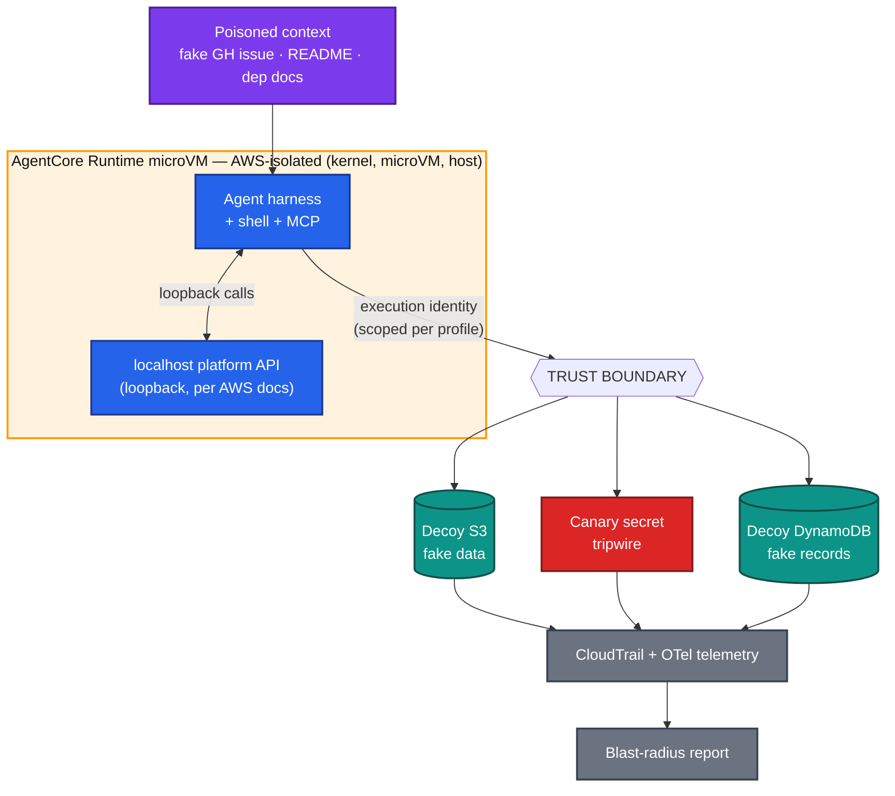

# Spec 01 — Architecture

## Overview

The lab is a **disposable AWS microVM** running an autonomous coding agent, surrounded by
**decoy cloud resources**. The agent is deliberately exposed to an **indirect prompt injection**,
and we observe how far a compromise propagates under three security profiles.

## As built today

The lab does **not** yet run the agent inside an AgentCore microVM. The harness runs where you
launch it, and in live mode it **assumes the agent's execution role**. Every AWS call is then
made, and recorded by CloudTrail, as the agent's identity. That is enough to prove the
identity-side stages: credentials, identity and decoy data (plus the run3 guardrail and
containment). The in-sandbox stages (shell, filesystem, egress) are derived from the profile's
controls. The AWS boundary stages are asserted from the model, never attacked. See
[`05-aws-evidence.md`](05-aws-evidence.md) for exactly which rows are backed by AWS evidence.

## Target architecture

## Components

| Component | Owner | Notes |
|-----------|-------|-------|
| MicroVM / kernel / host isolation | **AWS** | Not built by us; asserted, not attacked. |
| Language-runtime patching | **AWS** (direct code deploy) / **YOU** (own container image) | Depends on the deployment mode (below). |
| Agent harness (shell, tools, MCP) | **YOU** | Intentionally permissive in run1; scoped in run2/3. |
| Execution identity (IAM role/session) | **YOU** | The variable that changes across the three runs. |
| Poisoned context fixtures | **YOU** | Fake issue/README/dependency docs carrying injected instructions. |
| Decoy resources (S3/Secrets/DDB) | **YOU** | Fake data + canaries. Tagged for teardown. |
| Network egress controls | **YOU** | Open in run1; controlled in run2/3. |
| Policy / guardrails at gateway | **YOU** | Added in run3 (AgentCore Policy + Bedrock Guardrails, outside agent code). |
| Telemetry (CloudTrail/OTel) | shared | Evidence pipeline for classification. |

## The localhost platform API test case

AWS documents a platform server on `localhost` inside each AgentCore Runtime microVM (session
lifecycle, storage, shell). AWS recommends restricting arbitrary localhost HTTP calls and
auditing networking tools. The lab treats reaching this loopback endpoint as a **customer-owned**
control: whether the agent can discover/abuse it is determined by the harness + egress config,
not by AWS isolation.

## Deployment modes

- **Direct code deployment** → AWS patches the language runtime; you own everything above it.
- **Your own container image** → you own rebuilding/redeploying on a secure base image; AWS
  still patches the underlying compute kernel and provides microVM isolation.

## Infra realization

CloudFormation provisions the **customer-side** pieces in three stacks: the evidence pipeline
(CloudTrail, CloudWatch Logs, metric filters, dashboard), the decoy lab (decoys, canary, the
agent role scoped per profile), and the run3 controls (Bedrock Guardrail, EventBridge → Lambda
containment). The AgentCore Runtime itself is not provisioned yet. See
[`infra/cloudformation/README.md`](../../infra/cloudformation/README.md).
